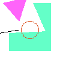
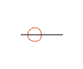
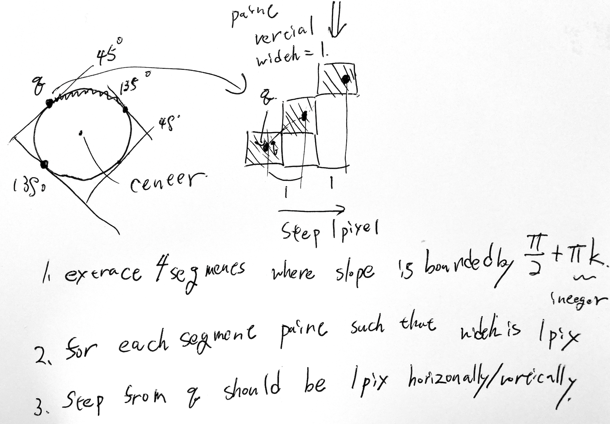

# Task01: Rasterization of Lines and Polygons

**Deadline: May 1st (Fri) at 15:00pm**

This is a preview of the expected result:



----


**The class introduces only very basics of Rust and GitHub. If you have any questions, or if you encounter any problem, ask chat-based AI (e.g., ChatGPT, DeepSeek, Claude) first.**

### Environment Set Up

Please install Git in your computer (if you do not have)

https://git-scm.com/book/en/v2/Getting-Started-Installing-Git

Check if the Git is installed by

```bash
$ git --version
```

Then install Rust in your computer
https://www.rust-lang.org/tools/install

Make sure the Rust is installed on your computer by typing in the terminal as:

```bash
$ cargo --version
```

### Local Repository Preparation

If you don't have the local repository (repository on your computer), clone it from the remote repository (repository on the GitHub).

```bash
$ git clone https://github.com/ACG-2026S/acg-<username>.git
```

Go to the top of the local repository, then make sure you are in the `main` branch

```bash
$ cd acg-<username>  # go to the local repository
$ git checkout main  # set main branch as the current branch
```

### Branch Creation

To do this assignment, you need to be in the branch `task01`. You can always check you are on the current branch by

```bash
$ git branch -a   # list all branches, showing the current branch 
```
You are probably in the main branch. Let's create the `task01` branch and set it as the current branch.

```bash
$ git branch task01   # create task01 branch
$ git checkout task01  # switch into the task01 branch
$ git branch -a   # make sure you are in the task01 branch
```

## Problem1: Draw a Triangle 

After the environment is ready, let's build and compile the code.

```bash
$ cd task01
$ cargo run --release
```

Now you will see the `output.gif` is generated. As shown below.



Now let's write a program to make more complicated images.
Edit the `src/main.rs` around line # 9 to area of the triangle for computing barycentric coordinates.   


## Problem2: Draw a Polygon

Edit the `src/main.rs` around line # 55 to implement the inside/outside test for a convex polygon using the winding number. 
This program paint where the winding number is 1.  


## Problem3: Draw a Line

Edit `src/main.rs` around line #87 to implement line rasterization using DDA (digital differential analyzer).


## Problem4: Draw a Circle

Edit `src/main.rs` around line # 109 to implement a circle rasterizer. 
Implement it using the way explained in the image. 



There are very efficient algorithm called Bresenham's circle drawing algorithm, but please do not use that in this assignment.  

## Submit

Finally, you submit the document by pushing to the `task01` branch of the remote repository. 

```bash
cd acg-<username>    # go to the top of the repository
git status  # check the changes (this will highlight main.rs and output.png)
git add .   # stage the changes
git status  # check the staged changes
git commit -m "task01 finished"   # the comment can be anything
git push --set-upstream origin task01  # up date the task01 branch of the remote repository
```

Go to the GitHub webpage `https://github.com/ACG-2026S/acg-<username>` . If everything looks good on this page, make a pull request. 


----


## Trouble Shooting

- I mistakenly submit the assignment in the `main` branch
  - Make a branch `task01` and submit again
- When I type `git status`, it shows many files. 
  - Do not commit intermediate files. If necessary edit the `.gitignore` file to remove the intermediate files.
- When something goes wrong, consider doing from scratch (start from `git clone`).  


